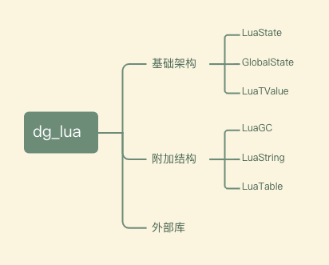

# dg_lua

## 项目结构

### 架构图



### 文件结构

```txt
├── CMakeLists.txt
├── README.md
├── clib
├── common
│   ├── lua-mem.c
│   ├── lua-mem.h
│   ├── lua-object.c
│   ├── lua-object.h
│   ├── lua-state.c
│   ├── lua-state.h
│   ├── lua-string.c
│   ├── lua-string.h
│   ├── lua-table.c
│   ├── lua-table.h
│   └── lua.h
├── compiler
├── doc
│   └── lua_struct.png
├── main.c
├── test
└── vm
    ├── lua-do.c
    ├── lua-do.h
    ├── lua-gc.c
    ├── lua-gc.h
    ├── lua-vm.c
    └── lua-vm.h
```

## 开发记录

### 一、基础架构

### 二、附加架构

### 三、项目编译

### 四、外部库
